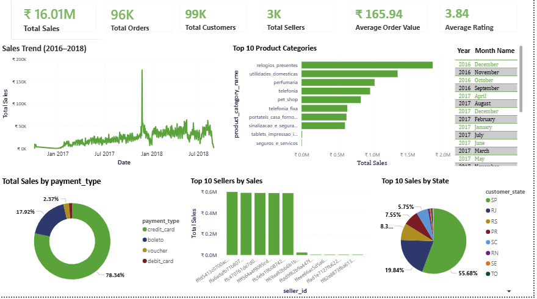

# E-Commerce-Powerbi-Dashboard
Interactive Power BI dashboard analyzing the Olist Brazilian E-Commerce dataset using Power BI, DAX, Power Query, and SQL.

# 📊 Olist E-Commerce Power BI Dashboard

## 📌 Project Overview

This project presents an interactive Power BI dashboard built using the Olist Brazilian E-Commerce dataset. The dashboard provides insights into sales performance, customer behavior, payment methods, product categories, and regional performance using Power BI, DAX, Power Query, and SQL.

---

## 🎯 Project Objectives

- Analyze overall sales performance
- Identify top-performing states and product categories
- Understand customer purchasing patterns
- Analyze payment methods
- Create an interactive dashboard using Power BI

---

## 🛠 Tools & Technologies

- Power BI
- Power Query
- DAX
- SQL
- Microsoft Excel

---

## 📂 Dataset

**Dataset:** Olist Brazilian E-Commerce Public Dataset

The dataset contains information about:

- Customers
- Orders
- Order Items
- Payments
- Products
- Sellers
- Reviews
- Geolocation

---

## 📈 Dashboard Features

### KPI Cards
- Total Sales
- Total Orders
- Total Customers
- Total Sellers
- Average Order Value
- Average Rating

### Visualizations

- Yearly Sales Trend
- Top 10 Product Categories
- Top Sales by Payment Type
- Top 10  Sellers by Sales
- Top 10  Sales by State
- Interactive Slicers

---

## 🔍 Key Insights

- Identified the highest revenue-generating states.
- Analyzed preferred payment methods.
- Compared yearly sales trends.
- Identified top-selling product categories.
- Built an interactive dashboard for business decision-making.

---

## 📷 Dashboard Preview



---

## 💡 Skills Demonstrated

- Data Cleaning
- Data Modeling
- DAX Measures
- Power Query
- SQL
- Dashboard Design
- Data Visualization

---

## 📁 Repository Structure

```
E-Commerce-Powerbi-Dashboard/
│
├── README.md
├── Dashboard Screenshot
├── Olist Dashboard.pbix
├── SQL Queries.sql
```

---


Skills:
- SQL
- Power BI
- DAX
- Power Query
- ETL Process
- Data Visulization
