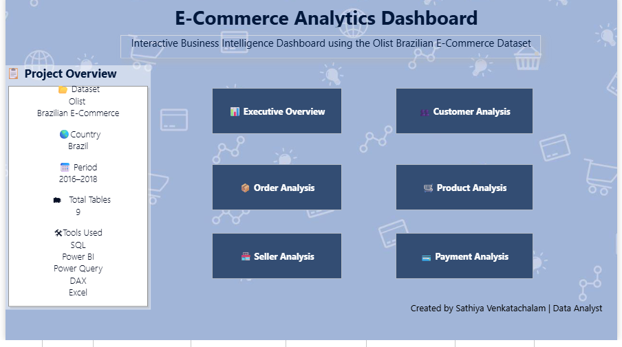
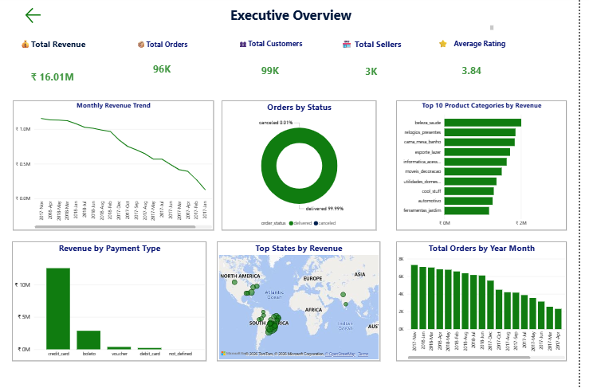
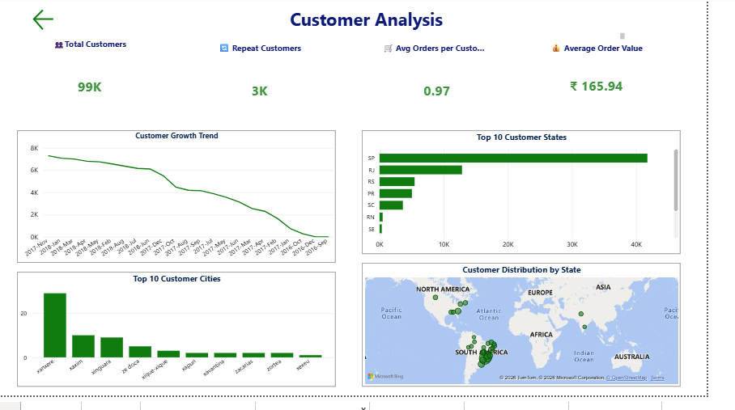

# 📊 E-Commerce Analytics Dashboard | Power BI

## 📌 Project Overview

The **E-Commerce Analytics Dashboard** is an end-to-end Business Intelligence project developed using the **Olist Brazilian E-Commerce Dataset**. This interactive Power BI dashboard transforms raw e-commerce data into meaningful business insights, enabling stakeholders to monitor sales performance, customer behavior, order trends, product performance, seller performance, and payment analysis.

The project demonstrates the complete data analytics workflow, including data cleaning, data transformation, data modeling, DAX calculations, KPI development, and interactive dashboard creation.

---

# 🎯 Business Problem

E-commerce businesses generate large volumes of transactional data every day. Without proper analysis, it becomes difficult to identify sales trends, understand customer behavior, evaluate seller performance, and make data-driven business decisions.

This dashboard helps business users answer critical questions such as:

- How is the business performing overall?
- Which products generate the highest revenue?
- Which states contribute the most sales?
- Who are the top-performing sellers?
- Which payment methods are preferred by customers?
- How are customer and order trends changing over time?

---

# 🎯 Project Objectives

- Build an interactive business intelligence dashboard using Power BI.
- Analyze overall business performance through KPIs.
- Monitor revenue and order trends over time.
- Understand customer purchasing behavior.
- Identify top-performing products and sellers.
- Analyze payment methods and transaction patterns.
- Support business decision-making using data-driven insights.

---

# 🛠 Tools & Technologies Used

- Power BI Desktop
- Power Query
- DAX (Data Analysis Expressions)
- SQL
- Microsoft Excel

---

# 📂 Dataset Information

**Dataset:** Olist Brazilian E-Commerce Dataset

**Source:** Kaggle

### Tables Used

- Customers
- Orders
- Order Items
- Products
- Sellers
- Payments
- Reviews
- Geolocation
- Product Category Name

**Total Tables Used:** 9

---

# 🔄 Project Workflow

1. Data Collection
2. Data Cleaning
3. Data Transformation
4. Data Modeling
5. DAX Measure Creation
6. KPI Development
7. Dashboard Design
8. Business Insight Generation

---

# 📊 Dashboard Pages

## 🏠 Home

The Home page provides an overview of the project and acts as the navigation page.

---

## 📈 Executive Overview

Provides a high-level summary of overall business performance.

---

## 👥 Customer Analysis

Provides insights into customer behavior and purchasing patterns.

---

## 📦 Order Analysis

Analyzes order performance and delivery status.

---

## 🛒 Product Analysis

Evaluates product and category performance.

---

## 🏪 Seller Analysis

Provides insights into seller performance.

---

## 💳 Payment Analysis

Analyzes customer payment behavior.

---

# 📊 Key Performance Indicators

- Total Revenue
- Total Orders
- Total Customers
- Total Sellers
- Total Products
- Repeat Customers
- Average Order Value
- Average Product Price
- Average Seller Rating
- Average Delivery Days
- Total Payment Value
- Average Payment

---

# 📈 Key Business Insights

- Credit Card is the most preferred payment method.
- São Paulo generates the highest revenue and order volume.
- A few product categories contribute a significant share of total revenue.
- Most orders are successfully delivered with a very low cancellation rate.
- Customer growth and monthly revenue trends help monitor business performance over time.
- Seller performance varies across states, highlighting opportunities for business expansion.

---

# ✨ Dashboard Features

- Interactive Navigation
- Dynamic KPI Cards
- Cross Filtering
- Drill-down Analysis
- Interactive Maps
- Synced Slicers
- Responsive Dashboard Layout
- Business-Oriented Visualizations

---

# 🛠 Skills Demonstrated

- Data Cleaning
- Data Transformation
- Data Modeling
- Power Query
- DAX
- SQL
- KPI Development
- Dashboard Design
- Data Visualization
- Business Intelligence
- Data Storytelling

---

# 📸 Dashboard Preview

- Home Page
  
  
- Executive Overview
  
  
- Customer Analysis
  
  
- Order Analysis
  
- Product Analysis
  
- Seller Analysis
  
- Payment Analysis

---

# 🚀 Business Value

This dashboard enables businesses to:

- Monitor overall business performance.
- Track sales and order trends.
- Understand customer purchasing behavior.
- Identify top-performing products and sellers.
- Analyze payment preferences.
- Support strategic business decisions using interactive dashboards.

---

# 👩‍💻 Author

**Sathiya Venkatachalam**

**Aspiring Data Analyst**

### Connect with Me

- Email: *sathiyavenkatachalam258@gmail.com*
- Mobile:*9385871378*
---

⭐ If you found this project useful, please consider giving it a ⭐ on GitHub.
